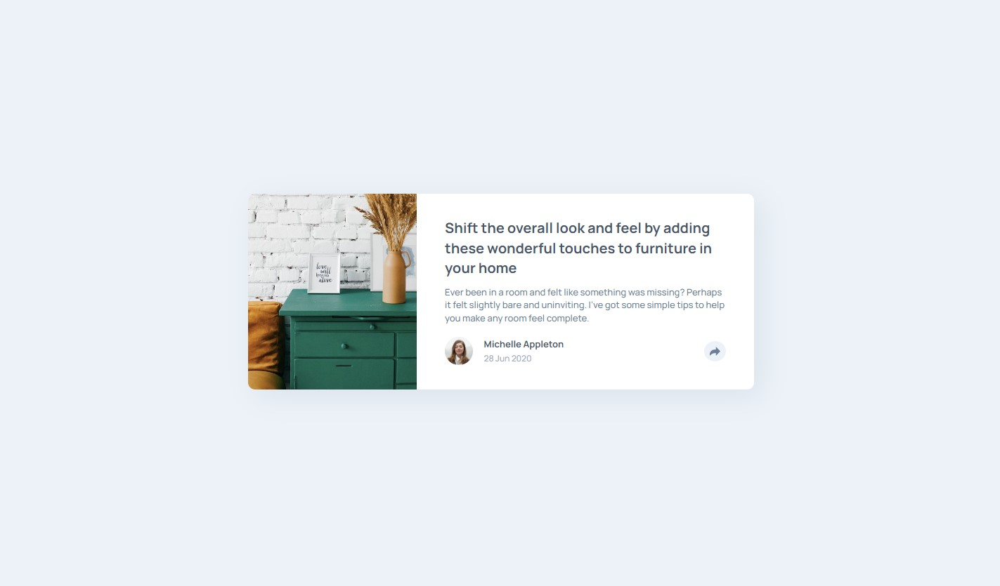

# Frontend Mentor - Article preview component solution

This is a solution to the [Article preview component challenge on Frontend Mentor](https://www.frontendmentor.io/challenges/article-preview-component-dYBN_pYFT).

## Table of contents

- [Overview](#overview)
  - [The challenge](#the-challenge)
  - [Screenshot](#screenshot)
  - [Links](#links)
- [My process](#my-process)
  - [Built with](#built-with)
- [Author](#author)

## Overview

### The challenge

Users should be able to:

- View the optimal layout for the component depending on their device's screen size
- See the social media share links when they click the share icon

### Screenshot

### Links

- Solution URL: [3-Column Preview Card](https://sophia-banou.github.io/frontend-mentor/3-column-preview-card-component-main/)

## My process

### Built with

- HTML
- CSS
- JQuery

## Author

- Frontend Mentor - [sophia-banou](https://www.frontendmentor.io/profile/sophia-banou)

