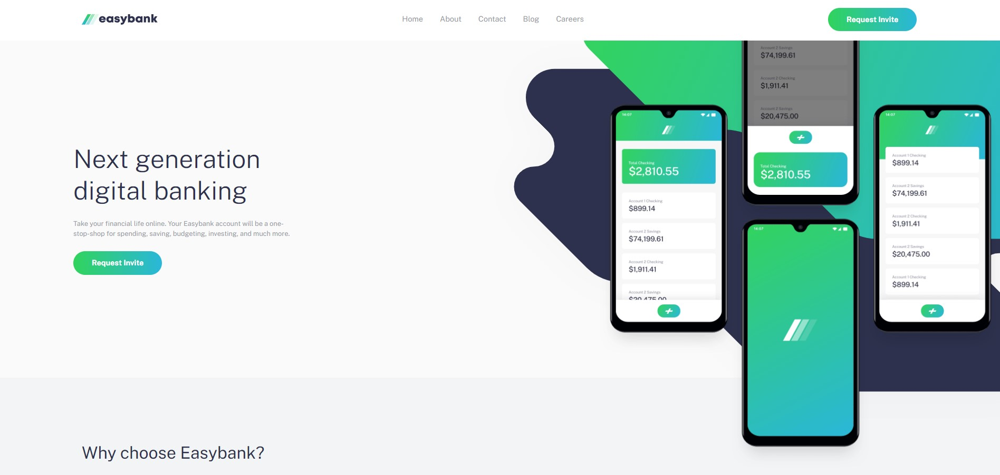

# Frontend Mentor - Easybank landing page solution

This is a solution to the [Easybank landing page challenge on Frontend Mentor](https://www.frontendmentor.io/challenges/easybank-landing-page-WaUhkoDN).

## Table of contents

- [Overview](#overview)
  - [The challenge](#the-challenge)
  - [Screenshot](#screenshot)
  - [Links](#links)
- [My process](#my-process)
  - [Built with](#built-with)
- [Author](#author)

## Overview

### The challenge

Users should be able to:

- View the optimal layout for the site depending on their device's screen size
- See hover states for all interactive elements on the page

### Screenshot

### Links

- Solution URL: [Easybank Landing Page](https://sophia-banou.github.io/frontend-mentor/easybank-landing-page-master/)

## My process

### Built with

- HTML
- CSS
- JQuery

## Author

- Frontend Mentor - [sophia-banou](https://www.frontendmentor.io/profile/sophia-banou)
