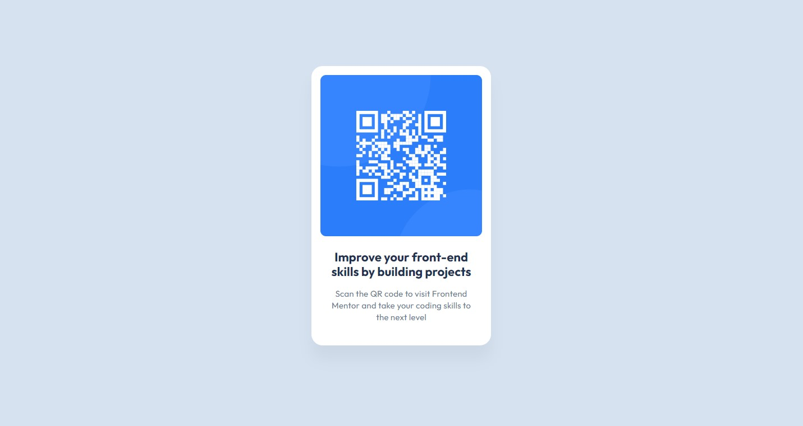

# Frontend Mentor - QR code component solution

This is a solution to the [QR code component challenge on Frontend Mentor](https://www.frontendmentor.io/challenges/qr-code-component-iux_sIO_H).
## Table of contents

- [Overview](#overview)
  - [Screenshot](#screenshot)
  - [Links](#links)
- [My process](#my-process)
  - [Built with](#built-with)
- [Author](#author)

## Overview

### Screenshot

### Links

- Solution URL: [QR Code Component](https://sophia-banou.github.io/frontend-mentor/qr-code-component-main/)

## My process

### Built with

- CSS
- HTML

## Author

- Frontend Mentor - [@sophia-banou](https://www.frontendmentor.io/profile/sophia-banou)