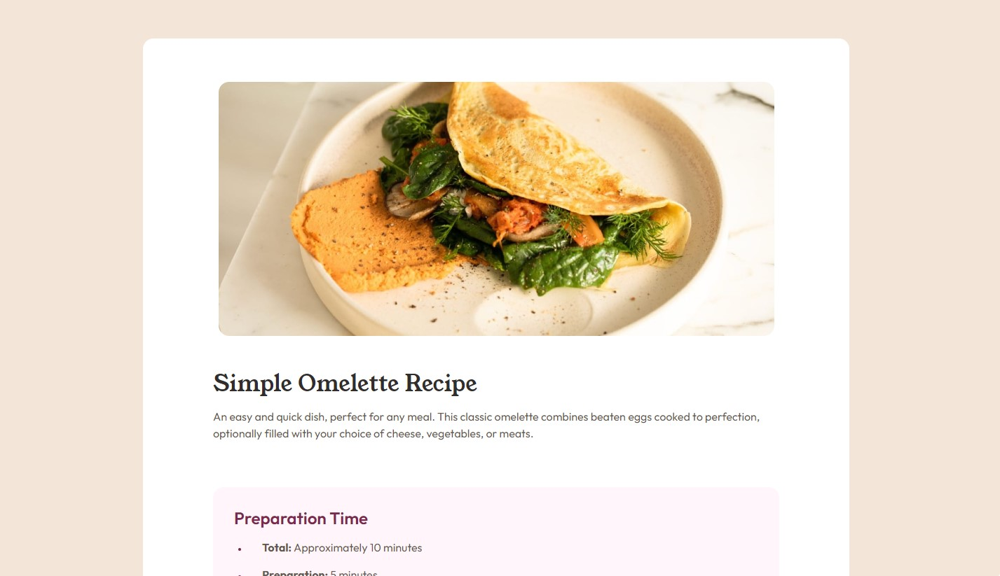

# Frontend Mentor - Recipe page solution

This is a solution to the [Recipe page challenge on Frontend Mentor](https://www.frontendmentor.io/challenges/recipe-page-KiTsR8QQKm).

## Table of contents

- [Overview](#overview)
  - [The challenge](#the-challenge)
  - [Screenshot](#screenshot)
  - [Links](#links)
- [My process](#my-process)
  - [Built with](#built-with)
- [Author](#author)

## Overview

### Screenshot

### Links

- Solution URL: [Recipe Page](https://sophia-banou.github.io/frontend-mentor/recipe-page-main/)

## My process

### Built with

- HTML
- CSS
- JQuery
- Bootstrap

## Author

- Frontend Mentor - [sophia-banou](https://www.frontendmentor.io/profile/sophia-banou)
